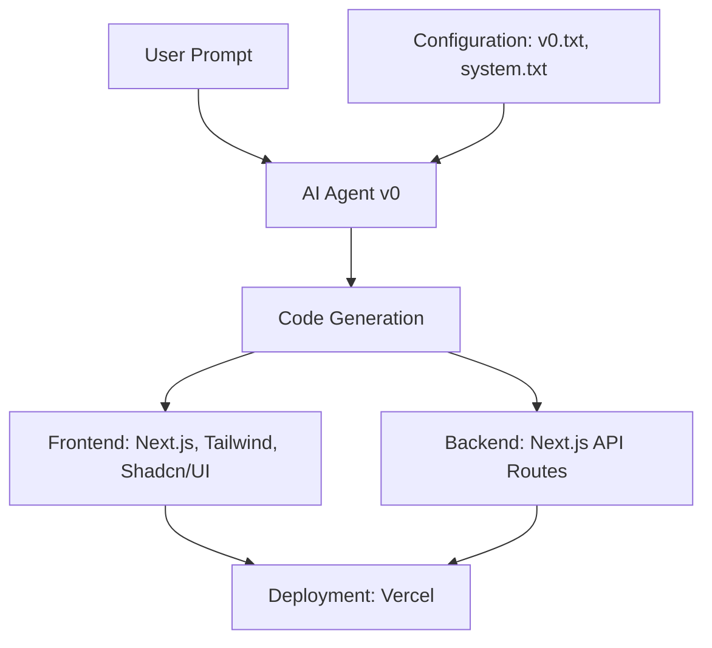

# ⚡ Lightning

**Lightning** is an AI-powered full-stack engineering system that transforms natural language prompts into production-ready code. Built with **Next.js**, **Tailwind CSS**, and **Shadcn/UI**, Lightning is optimized for **Vercel**, empowering developers to generate modern, secure, and scalable applications from simple instructions.

> 🚀 Version: 3.5.0  
> 🎯 Codename: *Lightning*  
> 👨‍💻 Creator: [Likhon Sheikh](https://github.com/likhonsheikh54)

---

## 🌩️ Introduction

Lightning revolutionizes full-stack development with natural language → code generation. It supports multiple AI providers (OpenAI, Together AI, Groq) and generates high-quality apps with strict standards across security, performance, SEO, and accessibility.


---

## 📦 Tech Stack

| Tool            | Use Case                             |
|-----------------|--------------------------------------|
| **Next.js**     | App Router, SSR, API Routes          |
| **Tailwind CSS**| Modern utility-first CSS             |
| **Shadcn/UI**   | UI components                        |
| **TypeScript**  | Type safety, strict mode             |
| **Supabase**    | Auth & Database                      |
| **Zod**         | Input validation                     |
| **React Query** | Data fetching and caching            |
| **NextAuth.js** | Authentication flows                 |
| **Vercel**      | Serverless deployments + analytics   |

---

## ⚙️ Getting Started

### ✅ Prerequisites

- **Node.js** (v16+)
- **npm** or **yarn**
- **Git**

### 🛠 Setup

```bash
git clone https://github.com/likhonsheikh54/Lightning.git
cd Lightning
npm install
npm run dev
```

Visit [http://localhost:3000](http://localhost:3000)

---

## ✨ Example Prompt Usage

### Prompt:
> "Create a login page with email and password fields, using Shadcn/UI components and Tailwind CSS."

### AI Output:

```tsx
import { Button } from "@/components/ui/button";
import { Input } from "@/components/ui/input";

export const Login = () => {
  return (
    <div className="flex items-center justify-center min-h-screen bg-black">
      <div className="p-6 bg-white rounded-lg shadow-lg border border-white/10">
        <h1 className="text-2xl font-bold mb-4">Login</h1>
        <Input type="email" placeholder="Email" className="mb-4" />
        <Input type="password" placeholder="Password" className="mb-4" />
        <Button variant="ghost">Login</Button>
      </div>
    </div>
  );
};
```

---

## 🤖 AI Provider Support

Configure any or all:

```env
OPENAI_API_KEY=your_openai_api_key
TOGETHER_API_KEY=your_together_api_key
GROQ_API_KEY=your_groq_api_key
```

---

## 🧠 AI Agent v0 Configuration

| File          | Role                                          |
|---------------|-----------------------------------------------|
| `v0.txt`      | Blueprint for folder structure & design rules |
| `system.txt`  | System prompt behavior for secure output      |

> These files can be dynamically edited via GitHub and auto-loaded at runtime.

---

## 🏗️ Architecture



---

## 📁 Folder Structure

```
/app         → App Router pages
/api         → API routes
/components  → UI Components
/lib         → Utilities
/hooks       → Custom React hooks
/types       → TypeScript interfaces/types
/utils       → Common helpers
/public      → Static assets
/styles      → Global CSS
```

---

## 🔧 Standards

### ✅ UI
- Black background (`#000000`)
- Rounded corners (≥ 0.5rem)
- Responsive, dark mode, mobile-first
- Accessible (WCAG AA)

### 🔒 Security
- OWASP Top 10
- Zod validation
- CSRF, CSP, rate limiting

### 📊 SEO
- Metadata API
- robots.txt + sitemap
- Open Graph + Twitter cards
- JSON-LD schema

### ⚡ Performance
- Core Web Vitals
- Code splitting, lazy loading
- SSR and edge functions
- Image optimization

---

## 🚀 Deployment (Vercel)

1. Push to GitHub
2. Connect GitHub to Vercel
3. Add environment variables
4. Deploy with 1-click

### 🔁 GitHub Actions

`.github/workflows/deploy.yml`

```yaml
name: Deploy to Vercel
on:
  push:
    branches:
      - main
jobs:
  build:
    runs-on: ubuntu-latest
    steps:
      - uses: actions/checkout@v2
      - name: Set up Node.js
        uses: actions/setup-node@v2
        with:
          node-version: '16'
      - name: Install Dependencies
        run: npm install
      - name: Build
        run: npm run build
      - name: Deploy to Vercel
        run: npx vercel --token=${{ secrets.VERCEL_TOKEN }}
```

---

## 🧪 Testing

- **Jest** – unit tests
- **React Testing Library** – component tests
- **Cypress** – E2E testing
- **Lighthouse** – performance
- **axe-core** – accessibility

---

## 📊 Monitoring

- **Vercel Analytics**
- **Error & performance monitoring**
- **User analytics**

---

## 🙌 Contributing

1. Fork the repo
2. Create a feature branch
3. Commit changes
4. Open a PR

Join the dev circle:

- Telegram: [t.me/likhonsheikh](https://t.me/likhonsheikh)
- GitHub: [github.com/likhonsheikh54](https://github.com/likhonsheikh54)
- Website: [likhon.dev](https://likhon.dev)

---

## 📄 License

**MIT License** – See `LICENSE` file.

---
Just say the word ⚡

**Built with ❤️ by Likhon Sheikh.**
